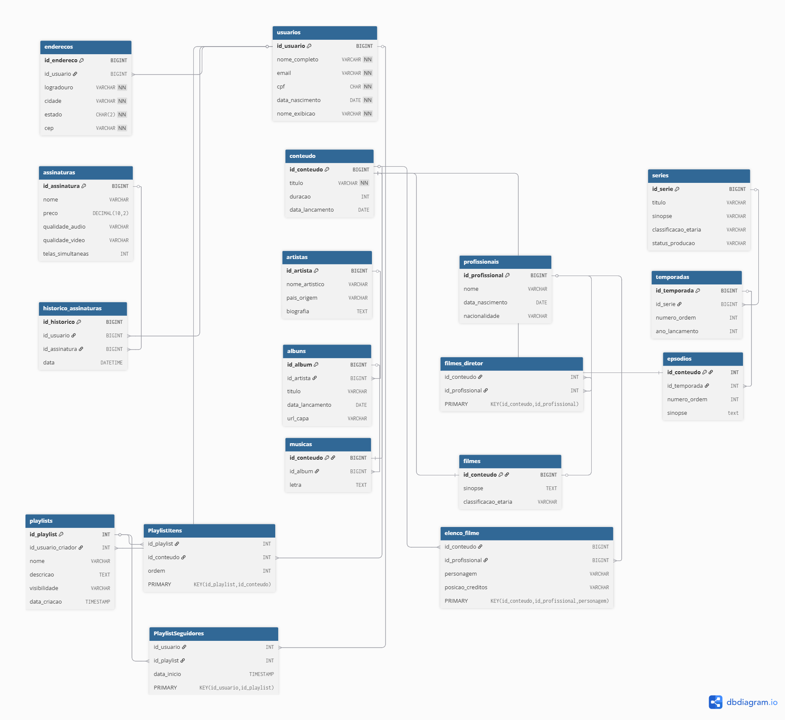

# StreamAll - Plataforma de Entretenimento Unificada

Este repositório contém o projeto de banco de dados da plataforma **StreamAll**, desenvolvido como requisito para a disciplina de Banco de Dados Relacional 2º semestre.

##  Sobre o Projeto
A StreamAll é uma plataforma que unifica o consumo de músicas, filmes e séries. O diferencial do sistema é permitir a criação de playlists híbridas, contendo diferentes tipos de mídia em uma única sequência.

##  Tecnologias Utilizadas
* **Modelagem:** dbdiagram.io (MER)
* **SGBD:** MariaDB / MySQL
* **Linguagem:** SQL (DDL)

##  Principais Conceitos Aplicados
* **Herança/Especialização:** Uso de uma supertabela `conteudos` para unificar músicas, filmes e episódios.
* **Entidades Fracas:** Modelagem de temporadas e episódios.
* **Relacionamentos N:N:** Gerenciamento de elencos, diretores e playlists.
* **Integridade Referencial:** Uso estratégico de PKs, FKs e Constraints.

##  Diagrama MER

